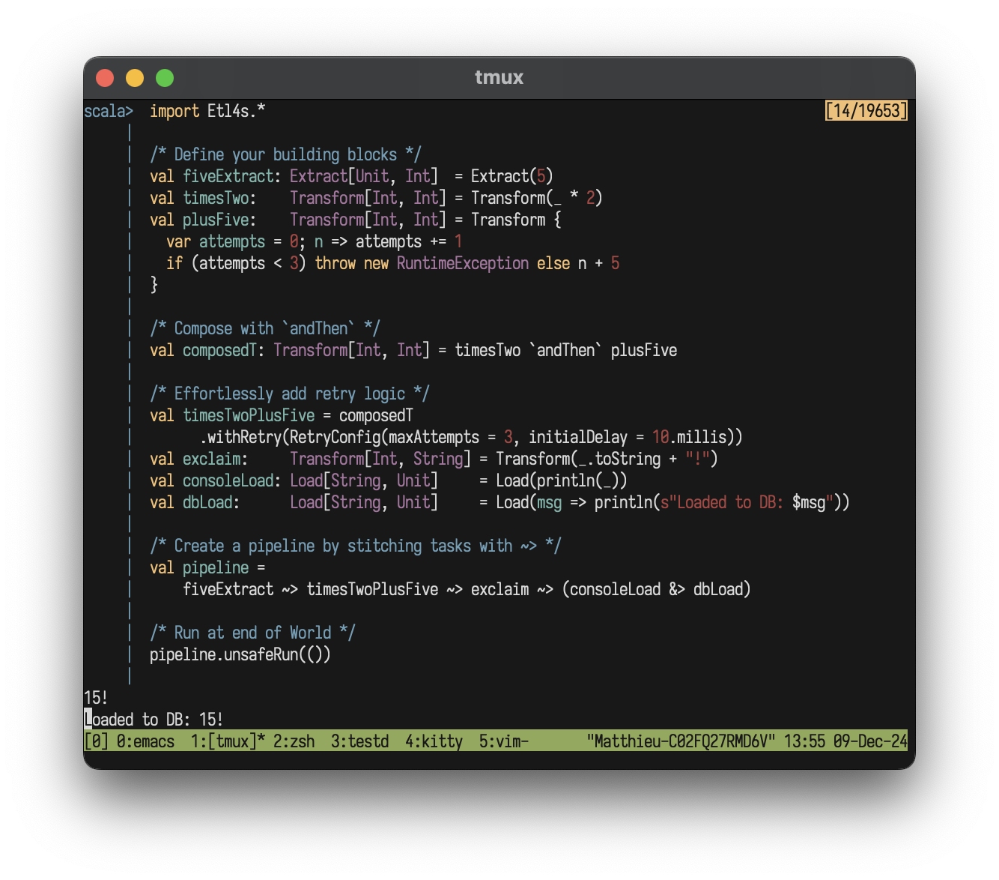

<p align="center">
  
</p>

#  etl4s
**Powerful, whiteboard-style ETL**

A lightweight, zero-dependency, library for writing type-safe, beautiful ✨🍰  data flows in functional Scala. Part of [d4s](https://github.com/mattlianje/d4s) 

## Features
- White-board style ETL
- Monadic composition for sequencing pipelines
- Drop **Etl4s.scala** into any Scala project like a header file
- Type-safe, compile-time checked pipelines
- Effortless concurrent execution of parallelizable tasks
- Built in retry/on-failure mechanism for nodes + pipelines

## Get started
> [!WARNING]  
> Releases sub `1.0.0` are experimental - breaking API changes might happen

**etl4s** is on MavenCentral:
```scala
"xyz.matthieucourt" % "etl4s_2.13" % "0.0.4"
```

Try it in your repl:
```bash
scala-cli repl --dep xyz.matthieucourt:etl4s_2.13:0.0.4
```

All you need:
```scala
import etl4s.core._
```

## Core Concepts
**etl4s** has 2 building blocks

#### `Pipeline[-In, +Out]`
A fully created pipeline composed of nodes chained with `~>`. It takes a type `In` and gives a `Out` when run.
Call `unsafeRun()` to "run-or-throw" - `safeRun()` will yield a `Try[Out]` Monad.

#### `Node[-In, +Out]`
`Node` Is the base abstraction of **etl4s**. A pipeline is stitched out of two or more nodes with `~>`. Nodes are just abstractions which defer the application of some run function: `In => Out`. The node types are:

- ##### `Extract[-In, +Out]`
The start of your pipeline. An extract can either be plugged into another function or pipeline or produce an element "purely" with `Extract(2)`. This is shorthand for `val e: Extract[Unit, Int] = Extract(_ => 2)`

- ##### `Transform[-In, +Out]`
A `Node` that represent a transformation. It can be composed with other nodes via `andThen`

- ##### `Load[-In, +Out]` 
A `Node` used to represent the end of a pipeline.

## Type safety
**etl4s** won't let you chain together "blocks" that don't fit together:
```scala
 val fiveExtract: Extract[Unit, Int]        = Extract(5)
 val exclaim:     Transform[String, String] = Transform(_ + "!")

 fiveExtract ~> exclaim
```
The above will not compile with:
```shell
-- [E007] Type Mismatch Error: -------------------------------------------------
4 | fiveExtract ~> exclaim
  |                ^^^^^^^
  |                Found:    (exclaim : Transform[String, String])
  |                Required: Node[Int, Any]
```

## Of note...
- Ultimately - these nodes and pipelines are just reifications of functions and values (with a few niceties like built in retries, failure handling, concurrency-shorthand, and Future based parallelism).
- Chaotic, framework/infra-coupled ETL codebases that grow without an imposed discipline drive dev-teams and data-orgs to their knees.
- **etl4s** is a little DSL to enforce discipline, type-safety and re-use of pure functions - 
and see [functional ETL](https://maximebeauchemin.medium.com/functional-data-engineering-a-modern-paradigm-for-batch-data-processing-2327ec32c42a) for what it is... and could be.


## Handling Failures
**etl4s** comes with 2 methods you can use (on a `Node` or `Pipeline`) to handle failures out of the box:

#### `withRetry`
Give retry capability using the built-in `RetryConfig`:
```scala
val riskyTransformWithRetry = Transform[Int, String] { n =>
    var attempts = 0
    attempts += 1
    if (attempts < 3) throw new RuntimeException(s"Attempt $attempts failed")
    else s"Success after $attempts attempts"
}.withRetry(
    RetryConfig(maxAttempts = 3, initialDelay = 10.millis)
)

val pipeline = Extract(42) ~> riskyTransformWithRetry
pipeline.unsafeRun(())
```
This prints:
```
Success after 3 attempts
```

#### `onFailure`
Catch some exception and perform some action:
```scala
val riskyExtract =
    Extract[Unit, String](_ => throw new RuntimeException("Boom!"))

val safeExtract = riskyExtract
                    .onFailure(e => s"Failed with: ${e.getMessage} ... firing missile")
val consoleLoad: Load[String, Unit] = Load(println(_))

val pipeline = safeExtract ~> consoleLoad
pipeline.unsafeRun(())
``` 
This prints:
```
Failed with: Boom! ... firing missile
```

## Parallelizing Tasks
**etl4s** has an elegant shorthand for grouping and parallelizing operations:
```scala
// Simulate slow IO operations (e.g., DB calls, API requests)
val e1 = Extract { Thread.sleep(100); 42 }
val e2 = Extract { Thread.sleep(100); "hello" }
val e3 = Extract { Thread.sleep(100); true }
```

Sequential run of e1, e2, and e3 **(~300ms total)**
```scala
val sequential = e1 & e2 & e3   /* Type: Extract[Unit, ((Int, String), Boolean)] */
```

Parallel run of e1, e2, e3 on their own JVM threads with Scala Futures **(~100ms total)**
```scala
val parallel = e1 &> e2 &> e3   /* Same result, much faster! */
```
Use zip method built into **etl4s** flatten unwieldly nested tuples:
```scala
val clean = (e1 & e2 & e3).zip  /* Type: Extract[Unit, (Int, String, Boolean)] */
```
Mix sequential and parallel execution:
```scala
val mixed = (e1 &> e2) & e3     /* First two parallel (~100ms), then third (~100ms) */
```

Full example of a parallel pipeline:
```scala
val merge: Transform[(Int, String, Boolean), String] =
  Transform(case(i, s, b) => s"$i-$s-$b")

val pipeline =
  (e1 &> e2 &> e3).zip ~> merge ~> (Load(println) &> Load(save))
```

## Built-in Tools
**etl4s** comes with 3 extra abstractions to make your pipelines hard like iron, and flexible like bamboo.
You can use them directly or swap in your own favorites (like the better implementations from [Cats](https://typelevel.org/cats/)). Just:
```scala
import etl4s.types.*
``` 

#### `Reader[R, A]`
Need database credentials? Services? API keys? Environment settings?
Let your pipeline know exactly what it needs to run, and switch configs effortlessly.
```scala
case class ApiConfig(url: String, key: String)
val config = ApiConfig("https://api.com", "secret")

val fetchUser = Reader[ApiConfig, Transform[String, String]] { config =>
  Transform(id => s"Fetching user $id from ${config.url}")
}

val loadUser = Reader[ApiConfig, Load[String, String]] { config =>
  Load(msg => s"User loaded with key ${config.key}: $msg")
}

val configuredPipeline = for {
  userTransform <- fetchUser
  userLoader    <- loadUser
} yield Extract("user123") ~> userTransform ~> userLoader

/* Run with config */
val result = configuredPipeline.run(config).unsafeRun(())

// "User loaded with key secret: Fetching user user123 from https://api.com"
```


#### `Writer[W, A]`
Collect logs at every step of your pipeline and get them all at once with your results.
No more scattered println's - just clean, organized logging, that shows exactly how your data flowed through the pipeline.
```scala
type Log = List[String]
type DataWriter[A] = Writer[Log, A]

val fetchUser = Transform[String, DataWriter[String]] { id =>
  Writer(
    List(s"Fetching user $id"),
    s"User $id"
  )
}

val processUser = Transform[DataWriter[String], DataWriter[String]] { writerInput =>
  for {
    value <- writerInput
    result <- Writer(
      List(s"Processing $value"),
      s"Processed: $value"
    )
  } yield result
}

val pipeline = Extract("123") ~> fetchUser ~> processUser
val (logs, result) = pipeline.unsafeRun(()).run()

// Logs: ["Fetching user 123", "Processing User 123"]
// Result: "Processed: User 123"
```


#### `Validated[E, A]`
No more failing on the first error! Get a complete list of what needs fixing.
Perfect for validating data on the edges of your pipelines (Just use `Validated.` `valid`/`invalid`... then `zip` on a `Validated` to "stack"
your validations).

```scala
case class User(name: String, age: Int)

def validateName(name: String): Validated[String, String] =
  if (!name.matches("[A-Za-z ]+")) Validated.invalid("Name can only contain letters")
  else Validated.valid(name)

def validateAge(age: Int): Validated[String, Int] =
  if (age < 0) Validated.invalid("Age must be positive")
  else if (age > 150) Validated.invalid("Age not realistic")
  else Validated.valid(age)

val validateUser = Transform[(String, Int), Validated[String, User]] {
  case (name, age) =>
    validateName(name)
      .zip(validateAge(age))
      .map { case (name, age) => User(name, age) }
}

val pipeline = Extract(("Alice4", -1)) ~> validateUser 
pipeline.unsafeRun(())
```

This returns:
```
Invalid("Name can only contain letters", "Age must be positive")
```


## Examples

#### Chain two pipelines
Simple piping of two pipelines:
```scala
val plusFiveExclaim: Pipeline[Unit, String] =
          Extract(1)
          ~> Transform((x: Int) => x + 5)
          ~> Transform((x: Int) => x.toString + "!")

val doubleString: Pipeline[String, String] =
          Extract((s: String) => s) ~> Transform((s: String) => s ++ s)

val plusFiveExclaimDouble: Pipeline[Int, Str] = plusFiveExclaimPipeline ~> doubleStrPipeline

println(plusFiveExclaimDouble(2))
```
Prints:
```
"7!7!"
```

#### Complex chaining
Connects the output of two pipelines to a third:
```scala
val fetchUser = Transform[String, String](id => s"Fetching $id")
val loadUser = Load[String, String](msg => s"Loaded: $msg")

// Create two simple pipelines
val namePipeline = Extract("alice") ~> fetchUser ~> loadUser
val agePipeline = Extract(25) ~> Transform(age => s"Age: $age")

// Combine them
val combined = for {
  name <- namePipeline
  age <- agePipeline
} yield Extract(s"$name | $age") ~> 
  Transform(_.toUpperCase) ~> 
  Load(println)

combined.unsafeRun(())
```
Prints:
```
"LOADED: FETCHING ALICE | AGE: 25"
```


## Real-world examples
See the [tutorial](tutorial.md) for examples of **etl4s** in combat. It works great with anything:
- Spark / Flink / Beam
- Bounded / Unbounded-data - ETL / Streaming
- Multi-physical-machine big data workflows
- Little web-server dataflows


## Inspiration
- Debasish Ghosh's [Functional and Reactive Domain Modeling](https://www.manning.com/books/functional-and-reactive-domain-modeling)
- [Akka Streams DSL](https://doc.akka.io/libraries/akka-core/current/stream/stream-graphs.html#constructing-graphs)
- Various Rich Hickey talks


