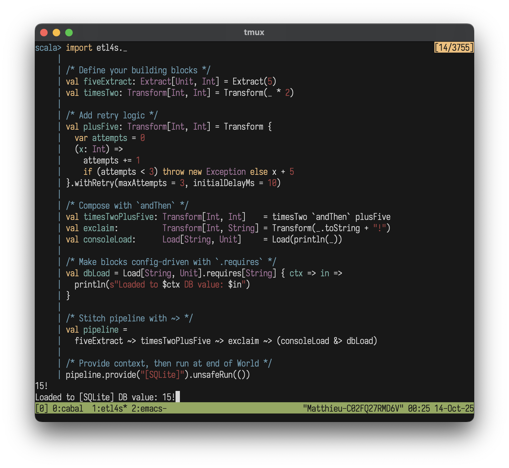
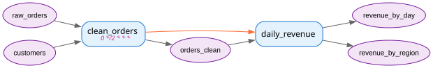

<div align="right">
  <sub><em>Part of <a href="https://github.com/mattlianje/d4"></a> <a href="https://github.com/mattlianje/d4">d4</a></em></sub>
</div>

<p align="center">
  
</p>

#  etl4s
**Powerful, whiteboard-style ETL**

A lightweight, zero-dependency library for writing type-safe, beautiful ✨🍰  data flows in functional Scala. 
Battle-tested at [Instacart](https://www.instacart.com/)

## Features
- Declarative, typed pipeline endpoints
- Zero-dependencies
- Type-safe, compile-time checked
- [Config-driven](#configuration) by design
- Easy, monadic composition of pipelines
- Built-in retry/failure handling
- [Data lineage](#lineage) visualization

## Installation

**etl4s** is on MavenCentral and cross-built for Scala, 2.12, 2.13, 3.x
```scala
"xyz.matthieucourt" %% "etl4s" % "1.9.1"
```
Or try in REPL:
```bash
scala-cli repl --scala 3 --dep xyz.matthieucourt:etl4s_3:1.9.1
```

All you need:
```scala
import etl4s._
```

## Quick Example
```scala
import etl4s._

val getUser  = Extract("John Doe")
val getOrder = Extract("Order #1234")
val combine  = Transform[(String, String), String] { case (user, order) =>
  s"$user placed $order"
}
val saveDb    = Load[String, String](s => { println(s"DB: $s"); s })
val sendEmail = Load[String, Unit](s => println(s"Email: $s"))

val pipeline = (getUser & getOrder) ~> combine ~> (saveDb & sendEmail)

pipeline.unsafeRun()
```

## Why etl4s?

- Ultimately, these nodes and pipelines are just reifications of functions and values with a few extra niceties.
- Chaotic, framework-coupled ETL codebases that grow without an imposed discipline drive dev teams and data orgs to their knees.
- **etl4s** is a lightweight DSL to enforce discipline, type-safety, and reuse of pure functions - and see [functional ETL](https://maximebeauchemin.medium.com/functional-data-engineering-a-modern-paradigm-for-batch-data-processing-2327ec32c42a) for what it is... and could be.


## Core Concepts
**etl4s** has one core building block:
```scala
Node[-In, +Out]
```
A Node wraps a lazily-evaluated function `In => Out`. Chain them with `~>` to build pipelines.

To improve readability and express intent, **etl4s** defines four aliases: `Extract`, `Transform`, `Load` and `Pipeline`. All behave the same under the hood.
and you run pipelines at the end of the World by calling `.unsafeRun(...)`

```scala
val step = Transform[String, Int](_.length)
step.unsafeRun("hello")  // 5
```

**DI:** Use `.requires` to turn any Node into a `Reader[Config, Node]`. The `~>` operator works between Nodes and Readers. See [Configuration](#configuration).

## Type safety
**etl4s** won't let you chain together "blocks" that don't fit together:
```scala
 val fiveExtract: Extract[Unit, Int]        = Extract(5)
 val exclaim:     Transform[String, String] = Transform(_ + "!")

 fiveExtract ~> exclaim
```
The above will not compile with:
```shell
-- [E007] Type Mismatch Error: -------------------------------------------------
4 | fiveExtract ~> exclaim
  |                ^^^^^^^
  |                Found:    (exclaim : Transform[String, String])
  |                Required: Node[Int, Any]
```

## Operators

etl4s uses a few simple operators to build pipelines:

| Operator | Name | Description | Example |
|----------|------|-------------|---------|
| `~>` | Connect | Chains operations in sequence | `e1 ~> t1 ~> l1` |
| `&` | Combine | Group operations with the **same** input | `t1 & t2` |
| `&>` | Parallel | Like `&`, but runs the branches concurrently | `t1 &> t2` |
| `**` | Product | Pair nodes with **different** inputs: `(A, C) => (B, D)` | `t1 ** t2` |
| `**>` | Product (parallel) | Like `**`, but runs the branches concurrently | `t1 **> t2` |
| `>>` | Sequence | Runs nodes in order with same input | `p1 >> p2` |

## Configuration

Declare what each step `.requires`, then `.provide` it later:

```scala
import etl4s._

case class ApiConfig(apiKey: String)

val fetchRaw   = Extract("data")
val callApi    = Transform[String, String].requires[ApiConfig] { cfg => data =>
  s"${cfg.apiKey}: $data"
}

val pipeline = fetchRaw ~> callApi

pipeline.provide(ApiConfig("secret")).unsafeRun(())  /* "secret: data" */
```

**etl4s** automatically infers the smallest shared config for your pipeline. Just `.provide` once.

Read more [here](https://mattlianje.github.io/etl4s/config/)

## Effect polymorphism
An **etl4s** pipeline is merely data - you choose how it runs by compiling it to an effect `F[_]`
via `.compile[F]`. **etl4s** ships `Id`, `Try`, and `Future` out of the box:

```scala
val parseAmount = Extract("41") ~> Transform[String, Int](_.toInt)

parseAmount.compile[Try].unsafeRun(())     // Success(41)
parseAmount.compile[Future].unsafeRun(())  // Future(41)
```

### Add your own effects
For example, to run your etl4s pipeline on the [Cats Effect](https://typelevel.org/cats-effect/)
fiber runtime, provide one instance:
```scala
import cats.effect.IO

given etl4s.Effect[IO] with {
  def pure[A](a: A): IO[A]                                    = IO.pure(a)
  def delay[A](thunk: => A): IO[A]                            = IO(thunk)
  def flatMap[A, B](fa: IO[A])(f: A => IO[B]): IO[B]          = fa.flatMap(f)
  def handleErrorWith[A](fa: => IO[A])(h: Throwable => IO[A]) = fa.handleErrorWith(h)
  override def both[A, B](fa: IO[A], fb: IO[B]): IO[(A, B)]   = IO.both(fa, fb)
}

val program: IO[Int] = parseAmount.compile[IO].unsafeRun(())
```

## Parallelizing Tasks
**etl4s** has an elegant shorthand for grouping and parallelizing operations that share the same input type:
```scala
/* Simulate slow IO operations (e.g: DB calls, API requests) */

val e1 = Extract { Thread.sleep(100); 42 }
val e2 = Extract { Thread.sleep(100); "Ada" }
val e3 = Extract { Thread.sleep(100); true }
```

Sequential run of e1, e2, and e3 **(~300ms total)**
```scala
val sequential: Extract[Unit, (Int, String, Boolean)] =
     e1 & e2 & e3
```

Run the three concurrently **(~100ms total, same result, 3X faster)**. Concurrency comes from the
effect you compile to
```scala
val parallel: Extract[Unit, (Int, String, Boolean)] =
     e1 &> e2 &> e3

parallel.compile[Future].unsafeRun(())
```

Mix sequential and parallel execution (first two parallel (~100ms), then third (~100ms)):
```scala
val mixed = (e1 &> e2) & e3
```

Full example of a parallel pipeline:
```scala
val consoleLoad: Load[String, Unit] = Load(println(_))
val dbLoad:      Load[String, Unit] = Load(x => println(s"DB Load: ${x}"))

val merge = Transform[(Int, String, Boolean), String] { case (userId, name, active) =>
    s"$userId-$name-$active"
  }

val pipeline =
  (e1 &> e2 &> e3) ~> merge ~> (consoleLoad &> dbLoad)
```

## Batch collections
Run a sub-pipeline over a collection with `each`, `eachPar` and `eachSlice`. Works on `List`, `Vector`, `Seq`, `Set`, and `Iterable` out of the box:

```scala
/* One at a time */
fetchOrders ~> each(validateOrder ~> enrichOrder) ~> writeOrdersToDB

/* N at once */
fetchOrders ~> eachPar(8)(validateOrder ~> enrichOrder) ~> writeOrdersToDB

/* Windows of N */
fetchOrders ~> eachSlice(500)(bulkUpsertOrders) ~> writeReport
```

### Custom batchables
Implement `etl4s.Batchable` to use your own container types:
```scala
import etl4s._

case class Page[A](items: Vector[A], nextCursor: Option[String])

given [A]: Batchable[Page[A], A, Page] with {
  def toSeq(page: Page[A])   = page.items
  def fromElems(xs: Seq[A])  = Page(xs.toVector, None)
  def fromSeq[B](xs: Seq[B]) = Page(xs.toVector, None)
}

fetchPage ~> eachPar(8)(enrichOrder)
```

## Handling Failures

#### `withRetry`
Retry failed operations:
```scala
import etl4s._

var attempts = 0
val callApi = Transform[Int, String] { x =>
  attempts += 1
  if (attempts < 3) throw new RuntimeException("fail")
  else "ok"
}.withRetry(maxAttempts = 3, initialDelayMs = 10)

Extract(42) ~> callApi  /* Succeeds on 3rd attempt */
```

#### `onFailure`
Catch exceptions and recover:
```scala
import etl4s._

val fetchUser = Extract[Unit, String](_ => throw new RuntimeException("Boom!"))
  .onFailure(e => s"Error: ${e.getMessage}")

fetchUser.unsafeRun(())  /* Returns "Error: Boom!" */
```

## Conditional Branching

Route data through different pipelines with `If`, `ElseIf`, and `Else`:

```scala
val pipeline = extractUser
  .If(_.tier == "premium")      (validateUser ~> enrichUser ~> toPremiumOffer)
  .ElseIf(_.tier == "standard") (validateUser ~> toStandardOffer)
  .Else                         (toGuestNotice)
```

Branch on config only with `IfCtx`/`ElseIfCtx`:
```scala
val pipeline = sourceReader
  .IfCtx(_.isBackfill)(backfillBranch)
  .ElseIfCtx(_.isDryRun)(dryRunBranch)
  .Else(normalBranch)
```

Plain `Node` branches are automatically lifted to `Reader` when mixed with config-aware branches - no manual wrapping needed.

Read more [here](https://mattlianje.github.io/etl4s/branching/).

## Side Effects
Use `.tap()` for side effects without disrupting pipeline flow:

```scala
import etl4s._

val listFiles: Extract[Any, List[String]] = Extract(_ => List("a.txt", "b.txt"))
                                              .tap(files => println(s"Processing: $files"))

val countFiles = Transform[List[String], Int](_.size)

listFiles ~> countFiles
```

Chain side effects with `>>`:
```scala
val logStart = Node { println("Starting...") }
val logEnd   = Node { println("Done!") }

val pipeline = logStart >> (listFiles ~> countFiles) >> logEnd
pipeline.unsafeRun()
```

## Tracing
Call `.unsafeRunTrace()` instead of `.unsafeRun()` to get back a plain `Trace[A]`
holding the result and how long it took

```scala
val wordLength = Transform[String, Int](_.length)

val trace = wordLength.unsafeRunTrace("hello")
trace.result // 5
trace.timeElapsedMillis // 2L
```

## Lineage

Track data lineage and visualize pipeline dependencies. Attach metadata to any Node or Reader then call `.toDot`, `.toJson` or `.toMermaid`
on individual instances or on Sequences:

```scala
val A = Node[String, String](identity)
  .lineage(
    name = "A",
    inputs = List("s1", "s2"),
    outputs = List("s3"),
    schedule = "0 */2 * * *"
  )

val B = Node[String, String](identity)
  .lineage(
    name = "B",
    inputs = List("s3"),
    outputs = List("s4", "s5")
  )
```

Export lineage as JSON, DOT (Graphviz), or Mermaid diagrams:

```scala
Seq(A, B).toJson
Seq(A, B).toDot
```

<p align="center">
  
</p>

```scala
Seq(A, B).toMermaid
```

```mermaid
graph LR
    classDef pipeline fill:#e1f5fe,stroke:#01579b,stroke-width:2px,color:#000
    classDef dataSource fill:#f3e5f5,stroke:#4a148c,stroke-width:2px,color:#000
    classDef cluster fill:#e8f5e8,stroke:#2e7d32,stroke-width:2px,color:#000

    A["A<br/>(0 */2 * * *)"]
    B["B"]
    s1(["s1"])
    s2(["s2"])
    s3(["s3"])
    s4(["s4"])
    s5(["s5"])

    s1 --> A
    s2 --> A
    A --> s3
    s3 --> B
    B --> s4
    B --> s5
    A -.-> B
    linkStyle 6 stroke:#ff6b35,stroke-width:2px

    class A pipeline
    class B pipeline
    class s1 dataSource
    class s2 dataSource
    class s3 dataSource
    class s4 dataSource
    class s5 dataSource
```

**etl4s** automatically infers dependencies by matching output -> input sources. Nodes don't need to be connected with `~>` for lineage tracking. Explicit dependencies via `upstreams` also supported.

## Examples

#### Chain two pipelines
Simple UNIX-pipe style chaining of two pipelines:
```scala
import etl4s._

val p1 = Pipeline((i: Int) => i.toString)
val p2 = Pipeline((s: String) => s + "!")

val p3 = p1 ~> p2
```

#### Complex chaining
Connect the output of two pipelines to a third:
```scala
import etl4s._

val namePipeline = Pipeline("John Doe")
val agePipeline  = Pipeline(30)
val toUpper      = Transform[String, String](_.toUpperCase)
val consoleLoad  = Load[String, Unit](println(_))

val combined =
  for {
    name <- namePipeline
    age <- agePipeline
    _ <- Extract(s"$name | $age") ~> toUpper ~> consoleLoad
  } yield ()
```

## Real-world examples
**etl4s** works great with anything:
- Spark / Flink / Beam
- ETL / Streaming
- Distributed Systems
- Local scripts
- Big Data workflows
- Web-server dataflows

## Inspiration
- Debasish Ghosh's [Functional and Reactive Domain Modeling](https://www.manning.com/books/functional-and-reactive-domain-modeling)
- [Akka Streams DSL](https://doc.akka.io/libraries/akka-core/current/stream/stream-graphs.html#constructing-graphs)
- Various Rich Hickey talks


