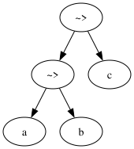
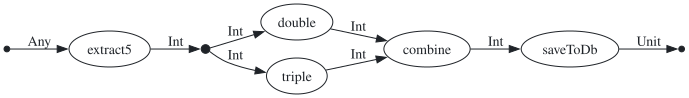
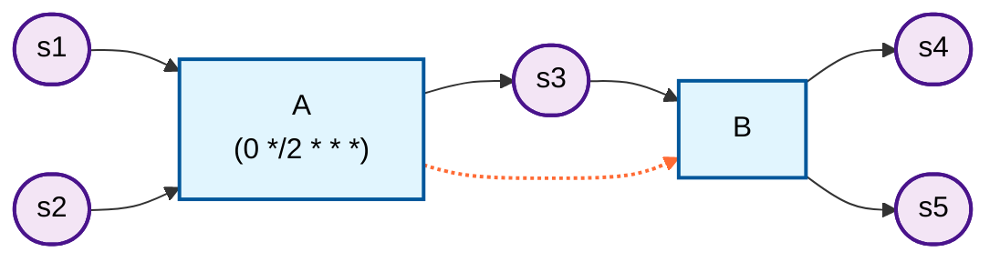

<div align="right">
  <sub><em>Part of <a href="https://github.com/mattlianje/d4"></a> <a href="https://github.com/mattlianje/d4">d4</a></em></sub>
</div>

<p align="center">
  
</p>

#  etl4s
**Powerful, whiteboard-style ETL**

A lightweight, zero-dependency library for writing type-safe, beautiful ✨🍰  data flows in functional Scala. 
Battle-tested at [Instacart](https://www.instacart.com/).

📖 [Full documentation](https://mattlianje.github.io/etl4s/)

## Features
- Declarative, typed pipeline endpoints
- Zero dependencies
- Type-safe, compile-time checked
- [Config-driven](#configuration) by design
- Easy composition of pipelines as free-arrows
- Built-in retry/failure handling
- [Data lineage](#lineage) visualization

## Installation

**etl4s** is on MavenCentral and cross-built for Scala, 2.12, 2.13, 3.x
```scala
"xyz.matthieucourt" %% "etl4s" % "1.9.1"
```
Or try in REPL:
```bash
scala-cli repl --scala 3 --dep xyz.matthieucourt:etl4s_3:1.9.1
```

All you need:
```scala
import etl4s._
```

## Quick Example
```scala
import etl4s._

val getUser  = Extract("John Doe")
val getOrder = Extract("Order #1234")
val combine  = Transform[(String, String), String] { case (user, order) =>
  s"$user placed $order"
}
val saveDb    = Load[String, String](s => { println(s"DB: $s"); s })
val sendEmail = Load[String, Unit](s => println(s"Email: $s"))

val pipeline = (getUser & getOrder) ~> combine ~> (saveDb & sendEmail)

pipeline.unsafeRun()
```
- `getUser` and `getOrder` each produce strings "purely"
- `&` groups them, and automatically tuples their output
- `combine` takes this tuple and creates a single string
- This string is then handled by `saveDb` and `sendEmail`
- `unsafeRun` is what actually runs the pipeline.

Suppose we now want to refactor and clean the combined data?
No problem, just add a `clean` block to your etl4s graph:

```scala
val pipeline = 
     (getUser & getOrder) ~> combine ~> clean ~> (saveDb & sendEmail)
```

## Why etl4s?

- Ultimately, these nodes and pipelines are just reifications of functions and values with a few extra niceties.
- Chaotic, framework-coupled ETL codebases that grow without an imposed discipline drive dev teams and data orgs to their knees.
- **etl4s** is a lightweight DSL to enforce discipline, type-safety, and reuse of pure functions - and see [functional ETL](https://maximebeauchemin.medium.com/functional-data-engineering-a-modern-paradigm-for-batch-data-processing-2327ec32c42a) for what it is... and could be.

## Core Concepts
**etl4s** has one core building block:
```scala
Node[-In, +Out]
```
A Node wraps a lazily-evaluated function `In => Out`. Chain them with `~>` to build pipelines.
To improve readability and express intent, **etl4s** defines three aliases: `Extract`, `Transform` and `Load`. All behave the same under the hood.

```scala
type Extract[In, Out]   = Node[In, Out]
type Transform[In, Out] = Node[In, Out]
type Load[In, Out]      = Node[In, Out]
```

## Operators

etl4s uses a few simple operators to build pipelines:

| Operator | Name | What it does |
|----------|------|--------------|
| `~>` | Chain | `a ~> b` - output of `a` feeds into `b` |
| `&` / `&>` | Fan-out | `a & b` - run both with the same input (`&>` runs them concurrently) |
| `*` / `*>` | Product | `a * b` - run on different inputs (`*>` runs them concurrently) |
| `>>` | Sequence | `a >> b` - run in order, keep `b`'s result |
| <code>&#124;</code> | Fan-in | <code>a &#124; b</code> - route an `Either` input to the matching branch |
| `+` | Choice | `a + b` - route an `Either` input through independent branches |
| <code>&lt;&#124;&gt;</code> | Fallback | <code>a &lt;&#124;&gt; b</code> - if `a` throws, run `b` on the same input |

## Type safety
**etl4s** won't let you chain together "blocks" that don't fit together:
```scala
 val fiveExtract: Extract[Unit, Int]        = Extract(5)
 val exclaim:     Transform[String, String] = Transform(_ + "!")

 fiveExtract ~> exclaim
```
The above will not compile with:
```shell
-- [E007] Type Mismatch Error: -------------------------------------------------
4 | fiveExtract ~> exclaim
  |                ^^^^^^^
  |                Found:    (exclaim : Transform[String, String])
  |                Required: Node[Int, Any]
```

## Introspection
A pipeline is a immutable value (an AST) you can look at before running. Every `Node` captures its shape,
its in/out types, and its enclosing `val` name at compile time. 

```scala
a ~> b ~> c
```
Compiles to:

```scala
AndThen(
  AndThen(Step("a", ...), Step("b", ...)),
  Step("c", ...)
)
```

<p align="center">
  
</p>

This unlocks the ability to interpret your pipelines however your want. Take:

```scala
val p =
     extract5 ~> (double & triple) ~> combine ~> saveToDb
```

Use `.toDot` or `.toMermaid` on any `Node`. You get:

<p align="center">
  
</p>

But you can just as easily write custom interpreters.

When your pipelines are inspectable values you get some superpowers for free:
- Unit test pipeline shape
- Govern dataflow architecture
- Generate docs at build time that never drift

## Configuration

Declare what each step `.requires`, then `.provide` it later:

```scala
import etl4s._

case class ApiConfig(apiKey: String)

val fetchUser = Extract("alice")
val callApi   = Transform[String, String].requires[ApiConfig] { cfg => user =>
  s"${cfg.apiKey}: $user"
}

val pipeline = fetchUser ~> callApi

pipeline.provide(ApiConfig("secret")).unsafeRun(())  /* "secret: alice" */
```

**etl4s** automatically infers the smallest shared config for your pipeline. Just `.provide` once.

Read more [here](https://mattlianje.github.io/etl4s/config/)

## Parallelizing Tasks
**etl4s** has an elegant shorthand for grouping and parallelizing operations when using `&>` or `*>`:
```scala
/* Simulate slow IO operations (e.g: DB calls, API requests) */

val e1 = Extract { Thread.sleep(100); 42 }
val e2 = Extract { Thread.sleep(100); "hello" }
val e3 = Extract { Thread.sleep(100); true }
```

Sequential run of e1, e2, and e3 **(~300ms total)**
```scala
val sequential: Extract[Unit, (Int, String, Boolean)] =
     e1 & e2 & e3
```

Parallel run of e1, e2, e3 on their own JVM threads with Scala Futures **(~100ms total, same result, 3X faster)**
```scala
val parallel: Extract[Unit, (Int, String, Boolean)] =
     e1 &> e2 &> e3
```

Mix sequential and parallel execution (first two parallel (~100ms), then third (~100ms)):
```scala
val mixed = (e1 &> e2) & e3
```

Full example of a parallel pipeline:
```scala
val consoleLoad = Load[String, Unit](println(_))
val dbLoad      = Load[String, Unit](x => println(s"DB Load: ${x}"))

val merge = Transform[(Int, String, Boolean), String] { case (i, s, b) =>
    s"$i-$s-$b"
  }

val pipeline =
  (e1 &> e2 &> e3) ~> merge ~> (consoleLoad &> dbLoad)
```

## Handling Failures

#### `withRetry`
Retry failed operations:
```scala
val callFlakyApi = Extract("response")
  .withRetry(maxAttempts = 3, initialDelayMs = 100)
```

#### `onFailure`
Catch exceptions and recover:
```scala
val fetchUser = Extract[Unit, String](_ => throw new RuntimeException("Boom!"))
  .onFailure(e => s"Error: ${e.getMessage}")

fetchUser.unsafeRun() /* "Error: Boom!" */
```

## Conditional Branching

Route data through different pipelines with `If`, `ElseIf`, and `Else`:

```scala
val pipeline = extractUser
  .If(_.tier == "premium")      (validateUser ~> enrichUser ~> toPremiumOffer)
  .ElseIf(_.tier == "standard") (validateUser ~> toStandardOffer)
  .Else                         (toGuestNotice)
```

Read more [here](https://mattlianje.github.io/etl4s/branching/).

## Side Effects
Use `.tap()` for side effects without disrupting pipeline flow:

```scala
val listFiles  = Extract(List("a.txt", "b.txt"))
                   .tap(files => println(s"Processing: $files"))

val countFiles = Transform[List[String], Int](_.size)

listFiles ~> countFiles
```

Chain side effects with `>>`:
```scala
val logStart = Node { println("Starting...") }
val logEnd   = Node { println("Done!") }

val pipeline = logStart >> (listFiles ~> countFiles) >> logEnd
```

## Lineage

Track data lineage and visualize pipeline dependencies. Attach metadata to any Node or Reader then call `.toDot`, `.toJson` or `.toMermaid`
on individual instances or on Sequences:

```scala
val A = Node[String, String](identity)
  .lineage(
    name = "A",
    inputs = List("s1", "s2"),
    outputs = List("s3"), 
    schedule = "0 */2 * * *"
  )

val B = Node[String, String](identity)
  .lineage(
    name = "B",
    inputs = List("s3"),
    outputs = List("s4", "s5")
  )
```

Export lineage as JSON, DOT (Graphviz), or Mermaid diagrams:

```scala
Seq(A, B).toJson
Seq(A, B).toDot
```

<p align="center">
  
</p>

```scala
Seq(A, B).toMermaid
```

```mermaid
graph LR
    classDef pipeline fill:#e1f5fe,stroke:#01579b,stroke-width:2px,color:#000
    classDef dataSource fill:#f3e5f5,stroke:#4a148c,stroke-width:2px,color:#000
    classDef cluster fill:#e8f5e8,stroke:#2e7d32,stroke-width:2px,color:#000

    A["A<br/>(0 */2 * * *)"]
    B["B"]
    s1(["s1"])
    s2(["s2"])
    s3(["s3"])
    s4(["s4"])
    s5(["s5"])

    s1 --> A
    s2 --> A
    A --> s3
    s3 --> B
    B --> s4
    B --> s5
    A -.-> B
    linkStyle 6 stroke:#ff6b35,stroke-width:2px

    class A pipeline
    class B pipeline
    class s1 dataSource
    class s2 dataSource
    class s3 dataSource
    class s4 dataSource
    class s5 dataSource
```

**etl4s** automatically infers dependencies by matching output -> input sources. Nodes don't need to be connected with `~>` for lineage tracking. Explicit dependencies via `upstreams` also supported.

## Examples

#### Chain two pipelines
Simple UNIX-pipe style chaining of two pipelines:
```scala
import etl4s._

val p1 = Node((i: Int) => i.toString)
val p2 = Node((s: String) => s + "!")

val p3 = p1 ~> p2
```

#### Complex chaining
Connect the output of two pipelines to a third:
```scala
import etl4s._

val namePipeline = Node("John Doe")
val agePipeline  = Node(30)
val toUpper      = Node[String, String](_.toUpperCase)
val consoleLoad  = Node[String, Unit](println(_))

val combined =
     (namePipeline & agePipeline) ~> toUpper ~> consoleLoad
```

## Real-world examples
**etl4s** works great with anything:
- Spark / Flink / Beam
- ETL / Streaming
- Distributed Systems
- Local scripts
- Big Data workflows
- Web-server dataflows

## Inspiration
- Debasish Ghosh's [Functional and Reactive Domain Modeling](https://www.manning.com/books/functional-and-reactive-domain-modeling)
- [Akka Streams DSL](https://doc.akka.io/libraries/akka-core/current/stream/stream-graphs.html#constructing-graphs)
- Various Rich Hickey talks
