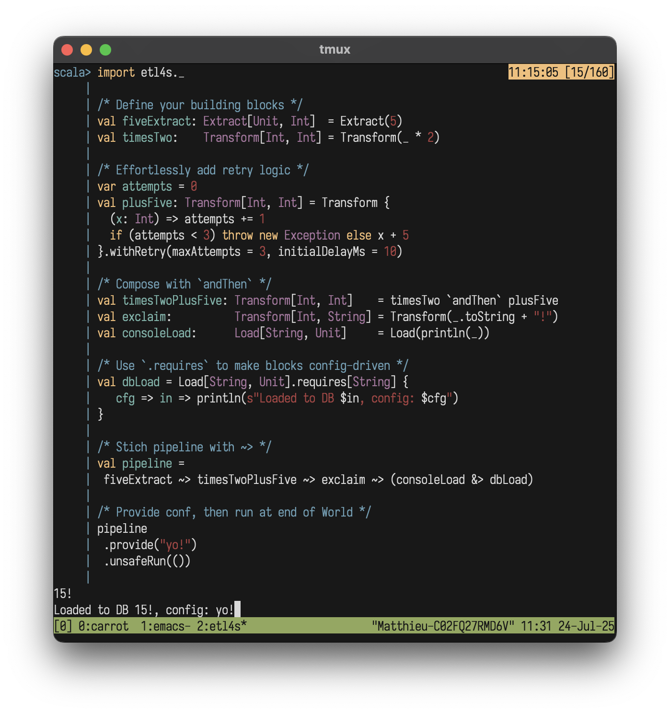

  

# etl4s
**Easy, whiteboard-style data**

A lightweight, type-safe library for building ETL pipelines using functional programming principles.

## Features
- White-board style ETL, snapped together from your functions
- Monadic composition for sequencing pipelines
- Drop **Etl4s.scala** into any Scala 2.12+ project like a header file
- Type-safe transformations w/ compile-time checking
- Concurrenct execution on-top of Scala Futures
- Built in retry-mechanism

## Get started
???

## Core Concepts
**Etl4s** has 3 building blocks and 2 main operators
