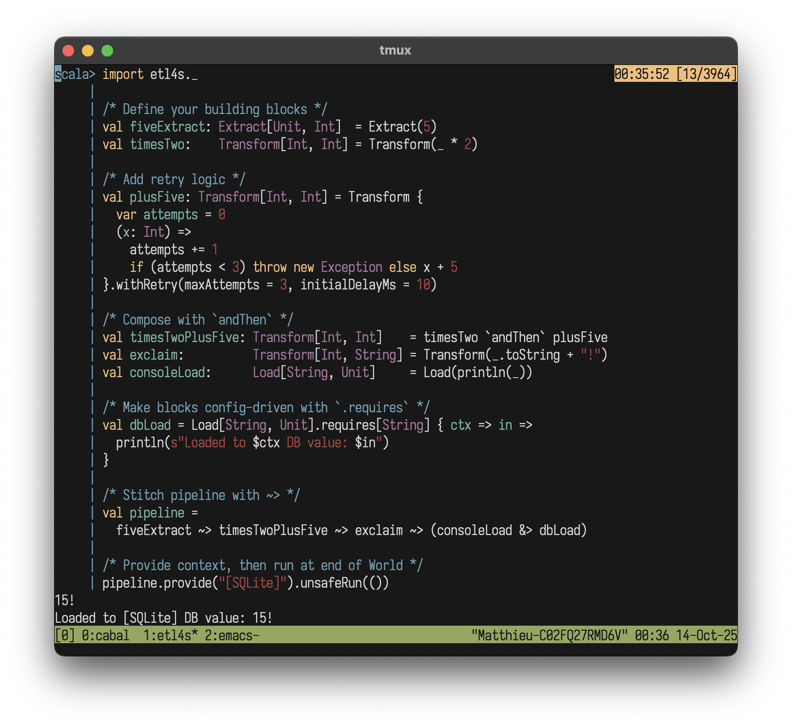

<p align="center">
  
</p>

#  etl4s
**Powerful, whiteboard-style ETL**

A lightweight, zero-dependency library for writing type-safe, beautiful ✨🍰  data flows in functional Scala. 
Battle-tested at [Instacart](https://www.instacart.com/). Part of [d4](https://github.com/mattlianje/d4)

<div align="center">
  <a href="https://www.bitcomplete.io/"></a>
  <sub><i> Sponsored by <a href="https://www.bitcomplete.io/">Bit Complete</a></i></sub>
</div>

## Features
- Declarative, typed pipeline endpoints
- Use **Etl4s.scala** like a header file
- Type-safe, compile-time checked
- [Config-driven](#configuration) by design
- Easy, monadic composition of pipelines
- Built-in retry/failure handling
- Automatic [tracing](#introspection-with-etl4strace)
- Drop-in [(open)telemetry](#telemetry)
- [Data lineage](#lineage) tracking and visualization

## Installation

**etl4s** is on MavenCentral and cross-built for Scala, 2.12, 2.13, 3.x
```scala
"xyz.matthieucourt" %% "etl4s" % "1.5.0"
```
Or try in REPL:
```bash
scala-cli repl --scala 3 --dep xyz.matthieucourt:etl4s_3:1.5.0
```

All you need:
```scala
import etl4s._
```

## Quick Example
```scala
import etl4s._

/* Define components */
val getUser  = Extract("John Doe")
val getOrder = Extract("2 items")
val process  = Transform[(String, String), String] { case (user, order) => 
  s"$user ordered $order" 
}
val saveDb    = Load[String, String](s => { println(s"DB: $s"); s })
val sendEmail = Load[String, Unit](s => println(s"Email: $s"))

/* Group tasks with &, Connect with ~> */
val pipeline =
     (getUser & getOrder) ~> process ~> (saveDb & sendEmail)
pipeline.unsafeRun(())
```

## Documentation 
[Full Documentation](https://mattlianje.github.io/etl4s/) - Detailed guides, API references, and examples


## Of note...
- Ultimately - these nodes and pipelines are just reifications of functions and values (with a few niceties like built in retries, failure handling, concurrency-shorthand, and Future based parallelism).
- Chaotic, framework/infra-coupled ETL codebases that grow without an imposed discipline drive dev-teams and data-orgs to their knees.
- **etl4s** is a little DSL to enforce discipline, type-safety and re-use of pure functions - and see [functional ETL](https://maximebeauchemin.medium.com/functional-data-engineering-a-modern-paradigm-for-batch-data-processing-2327ec32c42a) for what it is... and could be.


## Core Concepts
**etl4s** has one core building block:
```scala
Node[-In, +Out]
```
A Node wraps a lazily-evaluated function `In => Out`. Chain them with `~>` to build pipelines.

To improve readability and express intent, **etl4s** defines four aliases: `Extract`, `Transform`, `Load` and `Pipeline`.
All behave the same under the hood.

Drop in any function like:
```scala
val step = Transform[String, Int](_.length)
```

You can run nodes like plain functions:
```scala
val len: Int = step("HELLO") // 5
```
Or explicitly:
- `.unsafeRun(input)` - runs and throws on failure (trace collected internally)
- `.safeRun(input)` - returns a Try (trace collected internally) 
- `.unsafeRunTrace(input)` - returns Trace with logs, timeElapsedMillis, validation errors
- `.safeRunTrace(input)` - returns Trace with Try result safely

## Type safety
**etl4s** won't let you chain together "blocks" that don't fit together:
```scala
 val fiveExtract: Extract[Unit, Int]        = Extract(5)
 val exclaim:     Transform[String, String] = Transform(_ + "!")

 fiveExtract ~> exclaim
```
The above will not compile with:
```shell
-- [E007] Type Mismatch Error: -------------------------------------------------
4 | fiveExtract ~> exclaim
  |                ^^^^^^^
  |                Found:    (exclaim : Transform[String, String])
  |                Required: Node[Int, Any]
```

## Operators

etl4s uses a few simple operators to build pipelines:

| Operator | Name | Description | Example |
|----------|------|-------------|---------|
| `~>` | Connect | Chains operations in sequence | `e1 ~> t1 ~> l1` |
| `&` | Combine | Group sequential operations with same input | `t1 & t2` |
| `&>` | Parallel | Group concurrent operations with same input | `t1 &> t2` |
| `>>` | Sequence | Runs pipelines in order (ignoring previous output) | `p1 >> p2` |

## Configuration

Declare what each step `.requires`, then `.provide` it later:

```scala
import etl4s._

case class Cfg(key: String)

val A = Extract("data")
val B = Transform[String, String].requires[Cfg] { cfg => data =>
  s"${cfg.key}: $data"
}

val pipeline = A ~> B

pipeline.provide(Cfg("secret")).unsafeRun(())  /* "secret: data" */

/** NOTE (Scala 2.x)
  * Use: `Node.requires[Cfg, In, Out](cfg => in => out)` syntax
  */
```

**etl4s** automatically infers the smallest shared config for your pipeline. Just `.provide` once.

## Parallelizing Tasks
**etl4s** has an elegant shorthand for grouping and parallelizing operations that share the same input type:
```scala
/* Simulate slow IO operations (e.g: DB calls, API requests) */

val e1 = Extract { Thread.sleep(100); 42 }
val e2 = Extract { Thread.sleep(100); "hello" }
val e3 = Extract { Thread.sleep(100); true }
```

Sequential run of e1, e2, and e3 **(~300ms total)**
```scala
val sequential: Extract[Unit, ((Int, String), Boolean)] =
     e1 & e2 & e3
```

Parallel run of e1, e2, e3 on their own JVM threads with Scala Futures **(~100ms total, same result, 3X faster)**
```scala
import scala.concurrent.ExecutionContext.Implicits.global

val parallel: Extract[Unit, ((Int, String), Boolean)] =
     e1 &> e2 &> e3
```
Use the built-in zip method to flatten unwieldly nested tuples:
```scala
val clean: Extract[Unit, (Int, String, Boolean)] =
     (e1 & e2 & e3).zip
```
Mix sequential and parallel execution (First two parallel (~100ms), then third (~100ms)):
```scala
val mixed = (e1 &> e2) & e3
```

Full example of a parallel pipeline:
```scala
val consoleLoad: Load[String, Unit] = Load(println(_))
val dbLoad:      Load[String, Unit] = Load(x => println(s"DB Load: ${x}"))

val merge = Transform[(Int, String, Boolean), String] { t => 
    val (i, s, b) = t
    s"$i-$s-$b"
  }

val pipeline =
  (e1 &> e2 &> e3).zip ~> merge ~> (consoleLoad &> dbLoad)
```

## Handling Failures

#### `withRetry`
Retry failed operations:
```scala
import etl4s._

var n = 0
val A = Transform[Int, String] { x =>
  n += 1
  if (n < 3) throw new RuntimeException("fail")
  else "ok"
}.withRetry(maxAttempts = 3, initialDelayMs = 10)

Extract(42) ~> A  /* Succeeds on 3rd attempt */
```

#### `onFailure`
Catch exceptions and recover:
```scala
import etl4s._

val A = Extract[Unit, String](_ => throw new RuntimeException("Boom!"))
  .onFailure(e => s"Error: ${e.getMessage}")

A.unsafeRun(())  /* Returns "Error: Boom!" */
```

## Side Effects with `tap`
The `tap` method performs side effects without disrupting pipeline flow:

```scala
import etl4s._

val A = Extract(_ => List("a.txt", "b.txt"))
val B = Transform[List[String], Int](_.size)

A ~> tap(files => println(s"Cleanup: $files")) ~> B  /* tap passes data through */
```

## Introspection with `etl4s.Trace` 
Nodes can access and update their runtime state with ThreadLocal channels spawened for free. All state is automatically shared across your entire pipeline. Read more [here](https://mattlianje.github.io/etl4s/trace/)

```scala
val A = Transform[String, Int] { s =>
  if (s.isEmpty) Trace.error("empty")
  s.length
}

val B = Transform[Int, String] { n =>
  if (Trace.hasErrors) "FALLBACK" else s"len: $n"  
}

(A ~> B).unsafeRun("")  /* "FALLBACK" */
```

## Telemetry
etl4s provides a minimal `Etl4sTelemetry` interface for observability. All pipeline run methods automatically look for this interface in implicit scope.

`Tel` is etl4s's telemetry API object with the same method names as the trait for consistency. All `Tel` calls are no-ops by default - zero overhead until you provide an implementation.

```scala
val A = Transform[List[String], Int] { data =>
  Tel.withSpan("op") {
    Tel.addCounter("n", data.size)
    Tel.setGauge("v", data.size.toDouble)
    data.map(_.length).sum
  }
}

/* By default Tel calls are no-ops (zero cost) */
A.unsafeRun(data)

/* Implement Etl4sTelemetry for your backend */
implicit val telemetry: Etl4sTelemetry = MyPrometheusProvider()
A.unsafeRun(data) /* metrics flow to Prometheus */
```

The `Etl4sTelemetry` interface has just 4 methods: `withSpan`, `addCounter`, `setGauge`, `recordHistogram`
which cover 95% of observability needs. Read more in the [Telemetry guide](https://mattlianje.github.io/etl4s/opentelemetry/).

## Lineage

Track data lineage and visualize pipeline dependencies. Attach metadata to any Node or Reader then use `.toDot`, `.toJson` or `.toMermaid` on any of the afore or Sequences of:

```scala
val A = Node[String, String](identity)
  .lineage(
    name = "A",
    inputs = List("s1", "s2"),
    outputs = List("s3"), 
    schedule = Some("0 */2 * * *")
  )

val B = Node[String, String](identity)
  .lineage(
    name = "B",
    inputs = List("s3"),
    outputs = List("s4", "s5")
  )
```

Export lineage as JSON, DOT (Graphviz), or Mermaid diagrams:

```scala
Seq(A, B).toJson
Seq(A, B).toDot
```

<p align="center">
  
</p>

```scala
Seq(A, B).toMermaid
```


**etl4s** automatically infers dependencies by matching output → input sources. Nodes don't need to be connected with `~>` for lineage tracking. Explicit dependencies via `upstreams` also supported.

## Examples

#### Chain two pipelines
Simple UNIX-pipe style chaining of two pipelines:
```scala
import etl4s._

val p1 = Pipeline((i: Int) => i.toString)
val p2 = Pipeline((s: String) => s + "!")

val p3 = p1 ~> p2
```

#### Complex chaining
Connect the output of two pipelines to a third:
```scala
import etl4s._

val namePipeline = Pipeline("John Doe")
val agePipeline  = Pipeline(30)
val toUpper      = Transform[String, String](_.toUpperCase)
val consoleLoad  = Load[String, Unit](println(_))

val combined =
  for {
    name <- namePipeline
    age <- agePipeline
    _ <- Extract(s"$name | $age") ~> toUpper ~> consoleLoad
  } yield ()
```

## Real-world examples
**etl4s** works great with anything:
- Spark / Flink / Beam
- ETL / Streaming
- Distributed Systems
- Local scripts
- Big Data workflows
- Web-server dataflows

## Inspiration
- Debasish Ghosh's [Functional and Reactive Domain Modeling](https://www.manning.com/books/functional-and-reactive-domain-modeling)
- [Akka Streams DSL](https://doc.akka.io/libraries/akka-core/current/stream/stream-graphs.html#constructing-graphs)
- Various Rich Hickey talks


