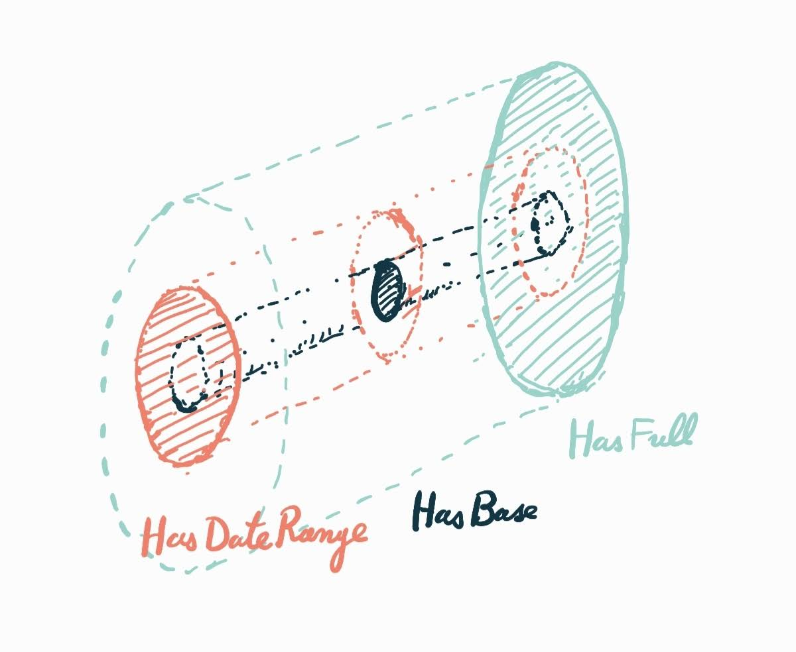

**etl4s** has a simple, powerful approach to dependency injection (aliased `Context`) based on `Reader` monads.
These just wrap your computations in the environment they need.

The "killer feature" is direct composition (via `~>`) of context-aware components without the usual flat-mapping boilerplate.
The most specific `Context` type needed is automatically resolved.


```scala
import etl4s._

case class ApiConfig(url: String, key: String)
val config = ApiConfig("https://api.example.com", "secret-key")

/* Create context-aware components
 * (mix with regular nodes)
 */
 val fetchData = Extract[String, String](id => s"Fetched $id ...")

val processData = Context[ApiConfig, Transform[String, String]] { ctx =>
  Transform(data => s"Processed with key ${ctx.key}: $data")
}

/* Connect them directly with ~> */
val pipeline = fetchData ~> processData

/* Provide config at runtime */
val result = pipeline.provideContext(config).unsafeRun("user123")
```

For cleaner code and access to the `WithContext` aliases use the `Etl4sContext` trait:
```scala
object DummyService extends Etl4sContext[ApiConfig] {
  val extract: ExtractWithContext[String, String] = Context { config => 
    Extract(id => s"Fetched $id from ${config.url}")
  }
  
  val transform: TransformWithContext[String, Int] = Context { config =>
    Transform(s => s.length)
  }
}

import DummyService._

val pipeline = extract ~> transform
```

### Aliases

With `Etl4sContext[T]`:

| Standard Type | etl4s Alias |
|:--------------|:------------|
| `Reader[T, Extract[A, B]]` | `ExtractWithContext[A, B]` |
| `Reader[T, Transform[A, B]]` | `TransformWithContext[A, B]` |
| `Reader[T, Load[A, B]]` | `LoadWithContext[A, B]` |
| `Reader[T, Pipeline[A, B]]` | `PipelineWithContext[A, B]` |

### Environment Propagation

**etl4s** automatically resolves context requirements through subtyping. When composing components with different but compatible environmental needs. The most specific type in the subtyping hierarchy is propagated.


```scala
import etl4s._

/* Define component capabilities */
trait HasBase { def appName: String }
trait HasDateRange extends HasBase { 
  def startDate: String
  def endDate: String 
}
trait HasFull extends HasDateRange {
  def dbUrl: String
}

/* Reusable component library */
object ETLComponents {
  val logger = Context[HasBase, Transform[String, String]] { cfg =>
    Transform(data => s"[${cfg.appName}] $data")
  }
  
  val dateProcessor = Context[HasDateRange, Transform[String, String]] { cfg =>
    Transform(data => s"$data (${cfg.startDate} to ${cfg.endDate})")
  }
  
  val dbSaver = Context[HasFull, Load[String, Boolean]] { cfg =>
    Load { data =>
      println(s"Saving to ${cfg.dbUrl}: $data")
      true
    }
  }
}
```

When connecting these components, **etl4s** automatically identifies that HasFull is required -
since it's a subtype that satisfies all component requirements

```scala
import ETLComponents._

val p = Extract("Job started") ~> logger ~> dateProcessor ~> dbSaver

/* Config provides the full context required by the pipeline */
case class JobConfig(
  appName: String,
  startDate: String,
  endDate: String,
  dbUrl: String
) extends HasFull

val result = p.provideContext(
  JobConfig("DataPipeline", "2023-01-01", "2023-01-31", "jdbc:pg://localhost")
).unsafeRun(())
```

