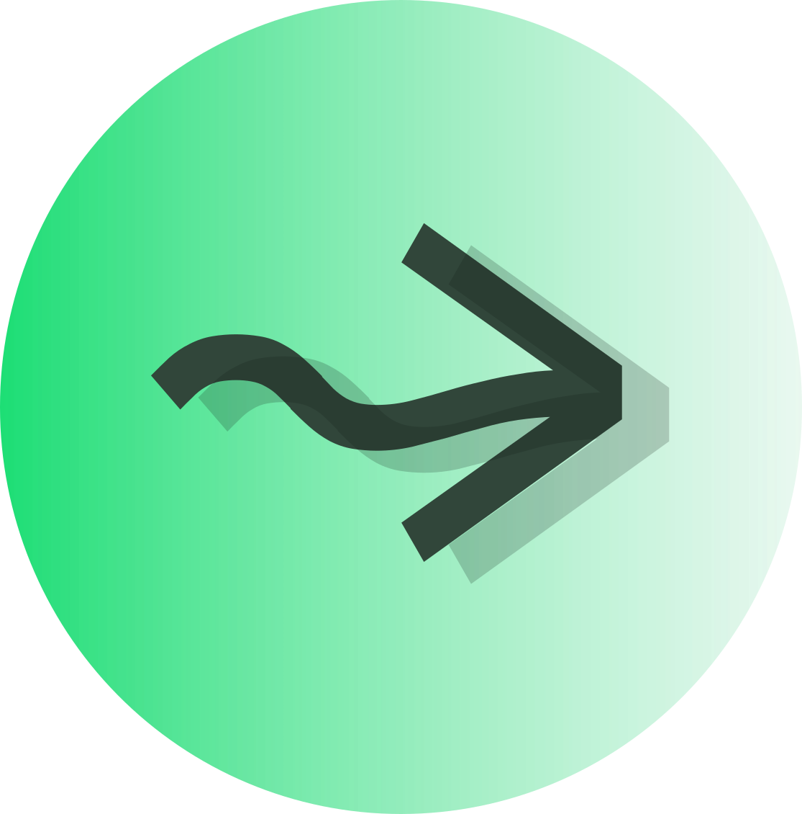

---
hide:
  - toc
---

<style>
/* Keep sidebar but hide TOC on index page */
.md-sidebar--secondary,
.md-sidebar--primary {
  display: none;
}

.md-content__inner {
  max-width: 700px !important;
  padding: 0 1rem !important;
  margin: 0 auto !important;
}

.intro-header {
  text-align: center;
  padding: 2rem 0 1rem 0;
}

.intro-header img {
  height: 64px;
  margin-bottom: 1rem;
  transition: transform 0.8s ease, filter 0.8s ease;
}

.intro-header img:hover {
  transform: scale(1.06);
  filter: drop-shadow(0 6px 20px rgba(0, 0, 0, 0.12));
}

@keyframes float {
  0%, 100% { transform: translateY(0); }
  50% { transform: translateY(-6px); }
}

/* Magnetic snap animation */
.magnet-demo {
  display: flex;
  align-items: center;
  justify-content: center;
  gap: 0;
  margin-bottom: 1.5rem;
  height: 24px;
}

.magnet-demo .node {
  width: 10px;
  height: 10px;
  border-radius: 50%;
  background: var(--md-primary-fg-color);
  opacity: 0.7;
}

.magnet-demo .node-left {
  animation: magnet-left 3s ease-in-out infinite;
}

.magnet-demo .node-right {
  animation: magnet-right 3s ease-in-out infinite;
}

.magnet-demo .connector {
  font-size: 0.75rem;
  opacity: 0;
  font-family: var(--mono, monospace);
  color: var(--md-primary-fg-color);
  animation: connector-appear 3s ease-in-out infinite;
  margin: 0 2px;
}

@keyframes magnet-left {
  0%, 10% { transform: translateX(-12px); opacity: 0.5; }
  40%, 60% { transform: translateX(0); opacity: 0.9; }
  90%, 100% { transform: translateX(-12px); opacity: 0.5; }
}

@keyframes magnet-right {
  0%, 10% { transform: translateX(12px); opacity: 0.5; }
  40%, 60% { transform: translateX(0); opacity: 0.9; }
  90%, 100% { transform: translateX(12px); opacity: 0.5; }
}

@keyframes connector-appear {
  0%, 30% { opacity: 0; }
  45%, 55% { opacity: 0.6; }
  70%, 100% { opacity: 0; }
}

/* Environment merge animation */
.env-merge-demo {
  display: flex;
  align-items: center;
  justify-content: center;
  gap: 0.75rem;
  margin: 2rem 0;
  font-family: var(--mono, monospace);
  font-size: 0.65rem;
}

.env-merge-demo .env {
  display: flex;
  flex-direction: column;
  align-items: center;
  gap: 0.4rem;
}

.env-merge-demo .dot {
  width: 10px;
  height: 10px;
  border-radius: 50%;
  background: var(--md-primary-fg-color);
}

.env-merge-demo .env-label {
  font-size: 0.6rem;
  opacity: 0.6;
  white-space: nowrap;
}

.env-merge-demo .env-a {
  animation: env-drift-left 5s ease-in-out infinite;
}

.env-merge-demo .env-b {
  animation: env-drift-right 5s ease-in-out infinite;
}

.env-merge-demo .env-result {
  animation: env-result-appear 5s ease-in-out infinite;
}

.env-merge-demo .env-result .dot {
  box-shadow: 0 0 8px var(--md-primary-fg-color);
}

.env-merge-demo .env-result .env-label {
  opacity: 0.8;
}

.env-merge-demo .merge-op {
  opacity: 0.4;
  animation: op-pulse 5s ease-in-out infinite;
}

.env-merge-demo .merge-eq {
  opacity: 0;
  animation: eq-appear 5s ease-in-out infinite;
}

@keyframes env-drift-left {
  0%, 15% { transform: translateX(-12px); opacity: 0.3; }
  40%, 60% { transform: translateX(0); opacity: 1; }
  85%, 100% { transform: translateX(-12px); opacity: 0.3; }
}

@keyframes env-drift-right {
  0%, 15% { transform: translateX(12px); opacity: 0.3; }
  40%, 60% { transform: translateX(0); opacity: 1; }
  85%, 100% { transform: translateX(12px); opacity: 0.3; }
}

@keyframes env-result-appear {
  0%, 45% { opacity: 0; transform: scale(0.7); }
  55%, 75% { opacity: 1; transform: scale(1); }
  90%, 100% { opacity: 0; transform: scale(0.7); }
}

@keyframes op-pulse {
  0%, 20% { opacity: 0.2; }
  40%, 60% { opacity: 0.6; }
  80%, 100% { opacity: 0.2; }
}

@keyframes eq-appear {
  0%, 45% { opacity: 0; }
  55%, 75% { opacity: 0.6; }
  90%, 100% { opacity: 0; }
}

/* Branch/union animation */
.branch-demo {
  display: flex;
  align-items: center;
  justify-content: center;
  gap: 0.5rem;
  font-family: var(--mono, monospace);
  font-size: 0.65rem;
}

.branch-demo .dot {
  width: 8px;
  height: 8px;
  border-radius: 50%;
  background: var(--md-primary-fg-color);
}

.branch-demo .branch-input {
  animation: branch-input-pulse 5s ease-in-out infinite;
}

.branch-demo .branch-split {
  display: flex;
  flex-direction: column;
  gap: 0.5rem;
}

.branch-demo .branch {
  display: flex;
  align-items: center;
  gap: 0.3rem;
}

.branch-demo .branch-label {
  font-size: 0.55rem;
  opacity: 0.5;
}

.branch-demo .env-label {
  font-size: 0.6rem;
  opacity: 0.6;
}

.branch-demo .branch-if {
  animation: branch-if-appear 5s ease-in-out infinite;
}

.branch-demo .branch-else {
  animation: branch-else-appear 5s ease-in-out infinite;
}

.branch-demo .merge-eq {
  opacity: 0;
  animation: eq-appear 5s ease-in-out infinite;
}

.branch-demo .branch-result {
  display: flex;
  flex-direction: column;
  align-items: center;
  gap: 0.3rem;
  animation: env-result-appear 5s ease-in-out infinite;
}

.branch-demo .branch-result .dot {
  box-shadow: 0 0 8px var(--md-primary-fg-color);
}

.branch-demo .branch-result .env-label {
  opacity: 0.8;
}

@keyframes branch-input-pulse {
  0%, 15% { opacity: 0.4; transform: scale(0.9); }
  25%, 40% { opacity: 1; transform: scale(1); }
  60%, 100% { opacity: 0.4; transform: scale(0.9); }
}

@keyframes branch-if-appear {
  0%, 20% { opacity: 0; transform: translateY(4px); }
  35%, 55% { opacity: 1; transform: translateY(0); }
  75%, 100% { opacity: 0; transform: translateY(4px); }
}

@keyframes branch-else-appear {
  0%, 25% { opacity: 0; transform: translateY(-4px); }
  40%, 55% { opacity: 1; transform: translateY(0); }
  75%, 100% { opacity: 0; transform: translateY(-4px); }
}

/* Platform animation */
.platform-demo {
  position: relative;
  width: 180px;
  height: 100px;
  font-family: var(--mono, monospace);
  margin: 0 auto;
}

.platform-demo .logo-source {
  width: 32px;
  height: 32px;
  position: absolute;
  top: 0;
  left: 50%;
  transform: translateX(-50%);
  opacity: 0.85;
}

.platform-demo .drop {
  width: 3px;
  height: 3px;
  border-radius: 50%;
  background: var(--md-primary-fg-color);
  position: absolute;
  opacity: 0;
  box-shadow: 0 0 4px var(--md-primary-fg-color);
}

/* JVM - left target */
.platform-demo .drop-jvm-1 { animation: drop-to-jvm 1.6s ease-out infinite; }
.platform-demo .drop-jvm-2 { animation: drop-to-jvm 1.6s ease-out infinite 0.4s; }
.platform-demo .drop-jvm-3 { animation: drop-to-jvm 1.6s ease-out infinite 0.8s; }
.platform-demo .drop-jvm-4 { animation: drop-to-jvm 1.6s ease-out infinite 1.2s; }

/* JS - center target */
.platform-demo .drop-js-1 { animation: drop-to-js 1.6s ease-out infinite 0.13s; }
.platform-demo .drop-js-2 { animation: drop-to-js 1.6s ease-out infinite 0.53s; }
.platform-demo .drop-js-3 { animation: drop-to-js 1.6s ease-out infinite 0.93s; }
.platform-demo .drop-js-4 { animation: drop-to-js 1.6s ease-out infinite 1.33s; }

/* Native - right target */
.platform-demo .drop-native-1 { animation: drop-to-native 1.6s ease-out infinite 0.27s; }
.platform-demo .drop-native-2 { animation: drop-to-native 1.6s ease-out infinite 0.67s; }
.platform-demo .drop-native-3 { animation: drop-to-native 1.6s ease-out infinite 1.07s; }
.platform-demo .drop-native-4 { animation: drop-to-native 1.6s ease-out infinite 1.47s; }

.platform-demo .platform {
  position: absolute;
  bottom: 0;
  font-size: 0.7rem;
  opacity: 0.7;
}

.platform-demo .platform-jvm { left: 12px; }
.platform-demo .platform-js { left: 50%; transform: translateX(-50%); }
.platform-demo .platform-native { right: 12px; }

/* Type safety animation */
.type-safety-demo {
  position: relative;
  width: 220px;
  height: 85px;
  font-family: var(--mono, monospace);
  font-size: 0.55rem;
  margin: 0 auto;
}

.type-safety-demo .node {
  position: absolute;
  display: flex;
  flex-direction: column;
  align-items: center;
  gap: 0.1rem;
}

.type-safety-demo .node-dot {
  width: 10px;
  height: 10px;
  border-radius: 50%;
  background: var(--md-primary-fg-color);
}

.type-safety-demo .node-label {
  font-size: 0.5rem;
  font-weight: 600;
  opacity: 0.8;
}

.type-safety-demo .node-type {
  font-size: 0.4rem;
  opacity: 0.5;
  white-space: nowrap;
}

.type-safety-demo .node-e { left: 10px; top: 18px; }
.type-safety-demo .node-t { left: 95px; top: 18px; animation: node-t-fade 6s ease-out infinite; }
.type-safety-demo .node-l { left: 180px; top: 18px; animation: node-l-move 6s ease-out infinite; }

.type-safety-demo .conn {
  position: absolute;
  top: 24px;
  font-size: 0.5rem;
  opacity: 0.4;
  color: var(--md-primary-fg-color);
}

.type-safety-demo .conn-et { left: 65px; transform: translateX(-50%); animation: conn-et-fade 6s ease-out infinite; }
.type-safety-demo .conn-tl { left: 152px; transform: translateX(-50%); animation: conn-tl-fade 6s ease-out infinite; }

.type-safety-demo .flow-dot {
  position: absolute;
  width: 4px;
  height: 4px;
  border-radius: 50%;
  background: var(--md-primary-fg-color);
  box-shadow: 0 0 6px var(--md-primary-fg-color);
  opacity: 0;
  top: 21px;
}

.type-safety-demo .flow-dot-1 { animation: flow-good 6s ease-out infinite; }
.type-safety-demo .flow-dot-2 { animation: flow-good 6s ease-out infinite 0.15s; }

.type-safety-demo .flow-bad {
  position: absolute;
  width: 4px;
  height: 4px;
  border-radius: 50%;
  background: #ef4444;
  box-shadow: 0 0 6px #ef4444;
  opacity: 0;
  top: 21px;
  animation: flow-fail 6s ease-out infinite;
}


.type-safety-demo .result {
  position: absolute;
  top: 60px;
  font-size: 0.5rem;
  opacity: 0;
}

.type-safety-demo .result-fail {
  left: 60px;
  top: 68px;
  color: #ef4444;
  white-space: nowrap;
  animation: result-fail-anim 6s ease-out infinite;
}

.type-safety-demo .node-dot {
  animation: node-pulse-green 6s ease-out infinite;
}

@keyframes node-pulse-green {
  0%, 30% { box-shadow: none; background: var(--md-primary-fg-color); }
  35%, 42% { box-shadow: 0 0 8px #14b8a6; background: #14b8a6; }
  47%, 68% { box-shadow: none; background: var(--md-primary-fg-color); }
  73%, 88% { box-shadow: 0 0 8px #ef4444; background: #ef4444; }
  93%, 100% { box-shadow: none; background: var(--md-primary-fg-color); }
}

@keyframes node-t-fade {
  0%, 42% { opacity: 1; }
  50%, 88% { opacity: 0; }
  95%, 100% { opacity: 1; }
}

@keyframes node-l-move {
  0%, 42% { left: 180px; }
  50%, 88% { left: 95px; }
  95%, 100% { left: 180px; }
}

@keyframes conn-tl-fade {
  0%, 42% { opacity: 0.4; }
  50%, 88% { opacity: 0; }
  95%, 100% { opacity: 0.4; }
}

@keyframes conn-et-fade {
  0%, 42% { opacity: 0.4; color: var(--md-primary-fg-color); }
  50%, 70% { opacity: 0.6; color: #ef4444; }
  75%, 88% { opacity: 0.4; color: #ef4444; }
  95%, 100% { opacity: 0.4; color: var(--md-primary-fg-color); }
}

@keyframes flow-good {
  0%, 5% { left: 18px; opacity: 0; }
  8% { opacity: 0.9; }
  18% { left: 100px; opacity: 0.9; }
  32% { left: 185px; opacity: 0.9; }
  36%, 100% { left: 185px; opacity: 0; }
}

@keyframes flow-fail {
  0%, 50% { left: 18px; opacity: 0; }
  53% { left: 18px; opacity: 0.9; }
  65% { left: 70px; opacity: 0.9; }
  70% { left: 75px; opacity: 0; }
  100% { opacity: 0; }
}

@keyframes result-ok-anim {
  0%, 32% { opacity: 0; }
  38%, 42% { opacity: 1; }
  47%, 100% { opacity: 0; }
}

@keyframes result-fail-anim {
  0%, 68% { opacity: 0; }
  73%, 88% { opacity: 1; }
  93%, 100% { opacity: 0; }
}

/* Typing animation */
.typing-demo {
  font-family: var(--mono, monospace);
  font-size: 13px;
  line-height: 1.5;
  color: var(--md-code-fg-color);
  background: var(--md-code-bg-color);
  border-radius: 4px;
  padding: 1em 1.2em;
  overflow: hidden;
  width: 280px;
  margin: 0 auto;
}

.typing-demo .line {
  white-space: pre;
  overflow: hidden;
  width: 0;
  opacity: 0;
}

.typing-demo .line-1 { animation: type-line1 8s steps(24, end) infinite; }
.typing-demo .line-2 { animation: type-line2 8s steps(14, end) infinite; }
.typing-demo .line-3 { animation: type-line3 8s steps(1, end) infinite; }
.typing-demo .line-4 { animation: type-line4 8s steps(14, end) infinite; }
.typing-demo .line-5 { animation: type-line5 8s steps(28, end) infinite; }

.typing-demo .c { color: var(--md-code-hl-comment-color); }
.typing-demo .k { color: var(--md-code-hl-keyword-color); }

@keyframes type-line1 {
  0%, 2% { width: 0; opacity: 1; }
  12% { width: 24ch; opacity: 1; }
  85%, 100% { width: 24ch; opacity: 1; }
}

@keyframes type-line2 {
  0%, 14% { width: 0; opacity: 0; }
  15% { width: 0; opacity: 1; }
  25% { width: 14ch; opacity: 1; }
  85%, 100% { width: 14ch; opacity: 1; }
}

@keyframes type-line3 {
  0%, 27% { width: 0; opacity: 0; }
  28% { width: 1ch; opacity: 1; }
  85%, 100% { width: 1ch; opacity: 1; }
}

@keyframes type-line4 {
  0%, 30% { width: 0; opacity: 0; }
  31% { width: 0; opacity: 1; }
  42% { width: 14ch; opacity: 1; }
  85%, 100% { width: 14ch; opacity: 1; }
}

@keyframes type-line5 {
  0%, 44% { width: 0; opacity: 0; }
  45% { width: 0; opacity: 1; }
  65% { width: 100%; opacity: 1; }
  85%, 100% { width: 100%; opacity: 1; }
}

@keyframes drop-to-jvm {
  0% { top: 32px; left: 50%; opacity: 0; transform: scale(0.5); }
  8% { opacity: 0.8; transform: scale(1); }
  95% { opacity: 0.8; transform: scale(1); }
  100% { top: 80px; left: 15%; opacity: 0; transform: scale(0.5); }
}

@keyframes drop-to-js {
  0% { top: 32px; left: 50%; opacity: 0; transform: scale(0.5); }
  8% { opacity: 0.8; transform: scale(1); }
  95% { opacity: 0.8; transform: scale(1); }
  100% { top: 80px; left: 50%; opacity: 0; transform: scale(0.5); }
}

@keyframes drop-to-native {
  0% { top: 32px; left: 50%; opacity: 0; transform: scale(0.5); }
  8% { opacity: 0.8; transform: scale(1); }
  95% { opacity: 0.8; transform: scale(1); }
  100% { top: 80px; left: 85%; opacity: 0; transform: scale(0.5); }
}

.intro-header h1 {
  font-size: 2.5rem;
  font-weight: 200;
  margin: 0.5rem 0;
  border: none !important;
  padding: 0 !important;
}

.intro-header p {
  font-size: 1.1rem;
  margin: 0.5rem 0 1.5rem 0;
  opacity: 0.9;
}

.intro-buttons {
  display: flex;
  gap: 1.5rem;
  justify-content: center;
  margin-bottom: 2rem;
  flex-wrap: wrap;
}

.intro-buttons a {
  padding: 0.3rem 0;
  text-decoration: none !important;
  font-size: 0.85rem;
  font-weight: 500;
  color: var(--md-primary-fg-color);
  border-bottom: 1.5px solid transparent;
  transition: border-color 0.15s ease, opacity 0.15s ease;
}

.intro-buttons a:hover {
  border-bottom-color: var(--md-primary-fg-color);
  opacity: 1;
}

/* Zen dividers */
.md-typeset hr {
  margin: 1.25rem auto;
  border: none;
  height: 1px;
  background: var(--md-default-fg-color--lightest);
  max-width: 120px;
}

/* Feature grid - Elm style */
.feature-grid {
  margin: 2rem 0;
}

.feature-row {
  display: flex;
  gap: 2rem;
  align-items: center;
  margin: 2.5rem 0;
}

.feature-row.reverse {
  flex-direction: row-reverse;
}

.feature-text {
  flex: 1.2;
}

.feature-text h3 {
  font-size: 0.85rem;
  font-weight: 600;
  margin: 0 0 0.4rem 0;
  color: var(--md-default-fg-color) !important;
  opacity: 1 !important;
}

.feature-text p {
  font-size: 0.75rem;
  line-height: 1.5;
  margin: 0;
  opacity: 0.9;
}

.feature-visual {
  flex: 0.8;
}

.feature-visual pre {
  margin: 0 !important;
  font-size: 0.8rem !important;
}

.feature-visual.quote blockquote {
  margin: 0;
  padding: 1rem 1.25rem;
  background: none;
  border: none;
  font-style: italic;
  font-size: 0.9rem;
  line-height: 1.5;
  position: relative;
}

.feature-visual.quote blockquote::before {
  content: "\201D";
  position: absolute;
  top: -1.5rem;
  left: -0.5rem;
  font-size: 8rem;
  font-family: Georgia, serif;
  color: var(--md-primary-fg-color);
  opacity: 0.2;
  line-height: 1;
  pointer-events: none;
  z-index: 0;
}

.feature-visual.quote blockquote > * {
  position: relative;
  z-index: 1;
}

.feature-visual.quote cite {
  display: block;
  margin-top: 0.75rem;
  font-size: 0.8rem;
  opacity: 0.7;
  font-style: normal;
}

/* Mobile adjustments */
@media (max-width: 768px) {
  .intro-header h1 {
    font-size: 2rem;
  }

  .intro-header p {
    font-size: 1rem;
  }

  .intro-buttons {
    flex-direction: column;
    align-items: stretch;
    max-width: 300px;
    margin-left: auto;
    margin-right: auto;
  }

  .intro-buttons a {
    text-align: center;
  }

  .feature-row,
  .feature-row.reverse {
    flex-direction: column;
    gap: 1rem;
  }

  .feature-text,
  .feature-visual {
    width: 100%;
  }
}
</style>

<div class="intro-header">
  
  <h1>etl4s</h1>
  <p style="opacity: 0.6; font-size: 0.85rem; margin: 0.5rem 0 1.5rem 0;">One file. Zero dependencies. Powerful, whiteboard-style ETL.</p>
  <div class="intro-buttons">
    <a href="installation/" class="btn-primary">Get Started</a>
    <a href="https://scastie.scala-lang.org/mattlianje/1280QhQ5RWODgizeXOIsXA/5" target="_blank" class="btn-secondary">Try Online</a>
    <a href="https://github.com/mattlianje/etl4s" target="_blank" class="btn-secondary">GitHub</a>
  </div>
</div>

=== "Chain"

    ```scala
    import etl4s._

    val extract = Extract(100)
    val half    = Transform[Int, Int](_ / 2)
    val double  = Transform[Int, Int](_ * 2)
    val format  = Transform[(Int, Int), String] { case (h, d) =>
      s"half=$h, double=$d"
    }

    val pipeline = extract ~> (half & double) ~> format

    pipeline.unsafeRun(())
    // "half=50, double=200"
    ```

=== "Config"

    ```scala
    import etl4s._

    case class DbConfig(host: String, port: Int)

    val extract = Extract(List("a", "b", "c"))
    val save = Load[List[String], Unit].requires[DbConfig] { db => data =>
      println(s"Saving ${data.size} rows to ${db.host}:${db.port}")
    }

    val pipeline = extract ~> save

    pipeline.provide(DbConfig("localhost", 5432)).unsafeRun(())
    // Saving 3 rows to localhost:5432
    ```

=== "Diagram"

    ```scala
    import etl4s._

    val e = Extract(1).named("source")
    val t = Transform[Int, Int](_ + 1).named("increment")
    val l = Load[Int, Unit](println).named("sink")

    val pipeline = e ~> t ~> l

    println(pipeline.toMermaid)
    ```

    ```mermaid
    graph LR
      source --> increment --> sink
    ```

=== "Telemetry"

    ```scala
    import etl4s._

    val process = Transform[List[String], Int] { data =>
      Tel.withSpan("processing") {
        Tel.addCounter("items", data.size)
        data.map(_.length).sum
      }
    }

    // Dev: no-ops (zero cost)
    process.unsafeRun(data)

    // Prod: plug in your backend
    implicit val tel: Etl4sTelemetry = MyOtelProvider()
    process.unsafeRun(data)
    ```

---

<div class="feature-grid">

<div class="feature-row">
<div class="feature-text">
<h3>Single file. Zero dependencies.</h3>
<p>A header-file lib (not a framework) that lets you structure code like whiteboard diagrams. Chain with <code>~></code>, parallelize with <code>&</code>, inject config with <code>.requires</code>. Works anywhere: scripts, Spark, Flink, your server.</p>
</div>
<div class="feature-visual">
<div class="typing-demo">
<div class="line line-1"><span class="c">// That's it. One import.</span></div>
<div class="line line-2"><span class="k">import</span> etl4s._</div>
<div class="line line-3"> </div>
<div class="line line-4"><span class="k">val</span> pipeline =</div>
<div class="line line-5">  extract ~> transform ~> load</div>
</div>
</div>
</div>

<div class="feature-row reverse">
<div class="feature-text">
<h3>Pipelines as values.</h3>
<p>Lazy, reified, composable. Pass them around, test them in isolation, generate diagrams from them. Teams share pipelines like Lego bricks. Refactoring is safe because types enforce the boundaries.</p>
</div>
<div class="feature-visual quote">
<blockquote>
(~>) is just *chef's kiss*. There are so many synergies here, haven't pushed for something this hard in a while.
<cite>— Sr Engineering Manager, Instacart</cite>
</blockquote>
</div>
</div>

<div class="feature-row">
<div class="feature-text">
<h3>For engineers & teams.</h3>
<p>Write <code>e ~> t ~> l</code>. Types must match or it won't compile. One core abstraction: <code>Node[In, Out]</code>. Structure survives people leaving. New hires read <code>e ~> (t1 & t2) ~> l</code> and get it. Auto-generated diagrams document your pipelines.</p>
</div>
<div class="feature-visual">
<div class="type-safety-demo">
  <div class="node node-e"><span class="node-dot"></span><span class="node-label">E</span><span class="node-type">[A, Int]</span></div>
  <span class="conn conn-et">~></span>
  <div class="node node-t"><span class="node-dot"></span><span class="node-label">T</span><span class="node-type">[Int, Str]</span></div>
  <span class="conn conn-tl">~></span>
  <div class="node node-l"><span class="node-dot"></span><span class="node-label">L</span><span class="node-type">[Str, B]</span></div>
  <span class="flow-dot flow-dot-1"></span>
  <span class="flow-dot flow-dot-2"></span>
  <span class="flow-bad"></span>
  <span class="result result-fail">won't compile</span>
</div>
</div>
</div>

<div class="feature-row reverse">
<div class="feature-text">
<h3>Under the hood:</h3>
<p>A lightweight effect system with one core <code>Node[-In, +Out]</code> abstraction. The <code>~></code> operator infers and merges environments seamlessly. <a href="faq/#how-it-works">Details in FAQ</a>.</p>
</div>
<div class="feature-visual quote">
<blockquote>
Seems to provide most of the advantages of full blown "effect systems" without the complexities, and awkward monad syntax!
<cite>— u/RiceBroad4552</cite>
</blockquote>
</div>
</div>

</div>

<div class="feature-grid">

<div class="feature-row">
<div class="feature-text">
<h3>Automatic environment inference.</h3>
<p>Chain nodes with different dependencies. The compiler figures out what the pipeline needs. No manual wiring.</p>
</div>
<div class="feature-visual">
<div class="env-merge-demo">
  <div class="env env-a">
    <span class="dot"></span>
    <span class="env-label">Needs[Db]</span>
  </div>
  <span class="merge-op">~></span>
  <div class="env env-b">
    <span class="dot"></span>
    <span class="env-label">Needs[Api]</span>
  </div>
  <span class="merge-eq">=</span>
  <div class="env env-result">
    <span class="dot"></span>
    <span class="env-label">Needs[Db & Api]</span>
  </div>
</div>
</div>
</div>

<div class="feature-row reverse">
<div class="feature-text">
<h3>Runs anywhere.</h3>
<p>Same code compiles to JVM, JavaScript, and Native. No platform-specific APIs.</p>
</div>
<div class="feature-visual">
<div class="platform-demo">
  
  <span class="drop drop-jvm-1"></span>
  <span class="drop drop-jvm-2"></span>
  <span class="drop drop-jvm-3"></span>
  <span class="drop drop-jvm-4"></span>
  <span class="drop drop-js-1"></span>
  <span class="drop drop-js-2"></span>
  <span class="drop drop-js-3"></span>
  <span class="drop drop-js-4"></span>
  <span class="drop drop-native-1"></span>
  <span class="drop drop-native-2"></span>
  <span class="drop drop-native-3"></span>
  <span class="drop drop-native-4"></span>
  <span class="platform platform-jvm">JVM</span>
  <span class="platform platform-js">JS</span>
  <span class="platform platform-native">Native</span>
</div>
</div>
</div>

</div>

---

<p style="text-align: center; opacity: 0.8; margin: 2rem 0;">
  Battle-tested at <a href="https://www.instacart.com/">Instacart</a> 🥕
</p>

---

## Get started

- [Installation](installation.md)
- [First Pipeline](first-pipeline.md)
- [Core Concepts](core-concepts.md)
- [Examples](examples.md)

<div style="margin-bottom: 4rem;"></div>
