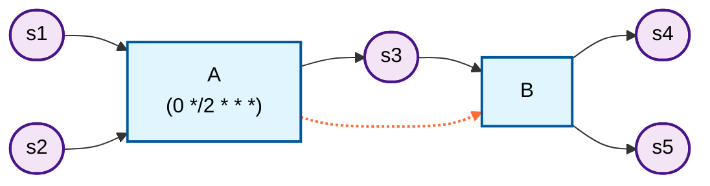

# Data Lineage

Track data lineage and generate visual pipeline diagrams.

## Quick Start

```scala
import etl4s._

val A = Node[String, String](identity)
  .lineage(
    name = "A",
    inputs = List("s1", "s2"),
    outputs = List("s3"), 
    schedule = Some("0 */2 * * *")
  )

val B = Node[String, String](identity)
  .lineage(
    name = "B",
    inputs = List("s3"),
    outputs = List("s4", "s5")
  )
```

Export to JSON, DOT (Graphviz), or Mermaid:

```scala
Seq(A, B).toJson
Seq(A, B).toDot
Seq(A, B).toMermaid
```

## Visualization

### Graphviz

<p align="center">
  
</p>

Generate DOT graphs for Graphviz:

```scala
val dot = Seq(A, B).toDot
```

### Mermaid



Orange dotted arrows show inferred dependencies.

## Parameters

- **`name`** (required): Unique identifier
- **`inputs`**: Input data sources (default: empty)
- **`outputs`**: Output data sources (default: empty)
- **`upstreams`**: Explicit dependencies (Nodes, Readers, or Strings)
- **`schedule`**: Human-readable schedule (e.g., "0 */2 * * *")
- **`cluster`**: Group name for organizing related pipelines

## Automatic Dependency Inference

**etl4s** infers dependencies by matching outputs to inputs:

```scala
val extract = Node[String, String](identity)
  .lineage("extract", inputs = List("db"), outputs = List("staging"))

val transform = Node[String, String](identity)
  .lineage("transform", inputs = List("staging"), outputs = List("clean"))

val load = Node[String, String](identity)
  .lineage("load", inputs = List("clean"), outputs = List("warehouse"))

Seq(extract, transform, load).toMermaid
```

Nodes don't need to be connected with `~>` for lineage tracking.

## Explicit Dependencies

Use `upstreams` for non-data dependencies:

```scala
val A = Node[User, EnrichedUser](enrich)
  .lineage("user-pipeline", inputs = List("raw_users"), outputs = List("users"))

val B = Node[Order, ProcessedOrder](process)  
  .lineage("order-pipeline", inputs = List("raw_orders"), outputs = List("orders"))

val C = Node[Data, Report](aggregate)
  .lineage(
    name = "analytics",
    inputs = List("data"),
    outputs = List("report"),
    upstreams = List(A, B)
  )
```

## JSON Export

```scala
val json = Seq(A, B).toJson
```

JSON structure includes:
- `pipelines`: Array of pipeline objects
- `dataSources`: Array of data source names
- `edges`: Connections with `isDependency` flag

Compatible with data catalog tools.

## Clusters

Group related pipelines:

```scala
val A = Node[Order, ProcessedOrder](process)
  .lineage(
    name = "validation",
    inputs = List("raw_orders"),
    outputs = List("valid_orders"),
    cluster = Some("order-processing")
  )
```

Clusters appear as grouped regions in visualizations.

## With Readers

```scala
case class Config(url: String)

val A = Reader[Config, Node[Data, Result]] { cfg =>
  Node(data => loadToDb(cfg.url, data))
}.lineage(
  name = "db-loader",
  inputs = List("processed"),
  outputs = List("stored"),
  cluster = Some("persistence")
)
```

## Best Practices

1. Use consistent naming for data sources
2. Match output/input names for auto-inference
3. Add schedules for operational clarity
4. Group with clusters
5. Use `upstreams` for operational dependencies

