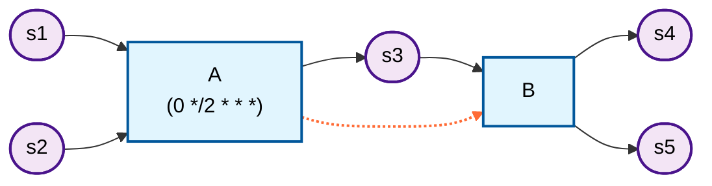

---
api:
  - sig: ".lineage(name, inputs, outputs, ...)"
  - sig: ".toDot"
  - sig: ".toMermaid"
  - sig: ".toJson"
  - sig: ".lineageName(name)"
  - sig: ".lineageInputs(inputs*)"
  - sig: ".lineageOutputs(outputs*)"
  - sig: ".withLineage(lineage)"
---

# Lineage

Attach lineage metadata with `.lineage` then use `.toDot`, `.toMermaid` or `.toJson` to
get the string representation of your lineage diagrams.

## Quick Start

```scala
import etl4s._

val A = Node[String, String](identity)
  .lineage(
    name = "A",
    inputs = List("s1", "s2"),
    outputs = List("s3"), 
    schedule = "0 */2 * * *"
  )

val B = Node[String, String](identity)
  .lineage(
    name = "B",
    inputs = List("s3"),
    outputs = List("s4", "s5")
  )
```

Export to JSON, DOT (Graphviz), or Mermaid:

```scala
Seq(A, B).toJson
Seq(A, B).toDot
Seq(A, B).toMermaid
```

## Visualization

### DOT

Generate DOT graphs for Graphviz:

```scala
Seq(A, B).toDot
```

<p align="center">
  
</p>

### Mermaid

```scala
Seq(A, B).toMermaid
```


```mermaid
graph LR
    classDef pipeline fill:#e1f5fe,stroke:#01579b,stroke-width:2px,color:#000
    classDef dataSource fill:#f3e5f5,stroke:#4a148c,stroke-width:2px,color:#000

    A["A<br/>(0 */2 * * *)"]
    B["B"]
    s1(["s1"])
    s2(["s2"])
    s3(["s3"])
    s4(["s4"])
    s5(["s5"])

    s1 --> A
    s2 --> A
    A --> s3
    s3 --> B
    B --> s4
    B --> s5
    A -.-> B
    linkStyle 6 stroke:#ff6b35,stroke-width:2px

    class A pipeline
    class B pipeline
    class s1 dataSource
    class s2 dataSource
    class s3 dataSource
    class s4 dataSource
    class s5 dataSource
```

Orange dotted arrows show inferred dependencies.

### JSON

```scala
Seq(A, B).toJson
```

The JSON has three top-level keys (all lowercase):

- `pipelines`: array of pipeline objects (with their `inputs`, `outputs`,
  `upstream_pipelines`, `schedule`, `description`, `group`, `tags`, `links`, ...)
- `datasources`: array of data source names
- `clusters`: array of cluster objects

## Lineage Parameters

- **`name`** (required): Unique identifier
- **`inputs`**: Input data sources (default: empty)
- **`outputs`**: Output data sources (default: empty)
- **`upstreams`**: Explicit dependencies (Nodes, Readers, or Strings)
- **`schedule`**: Human-readable schedule (e.g., "0 */2 * * *")
- **`cluster`**: Group name for organizing related pipelines
- **`description`**: Free-text description of the pipeline (default: "")
- **`group`**: Logical grouping label (default: "")
- **`tags`**: `List[String]` of arbitrary tags (default: empty)
- **`links`**: `Map[String, String]` of label -> URL links (default: empty)

`.lineage(...)` works the same on a `Reader[T, Node]` (config-aware node) as it
does on a plain `Node`.

### Low-level setters

For attaching metadata incrementally there are also individual setters:
`.lineageName(name)`, `.lineageInputs(inputs*)`, `.lineageOutputs(outputs*)`, and
`.withLineage(lineage)` (attach a fully-built `Lineage`). These are available on
both `Node` and `Reader`.

### Lineage vs structural introspection

`.toDot` / `.toMermaid` dispatch on what they're called on:

- On a **`Seq`** of lineage-annotated nodes/readers they draw the *dataflow
  graph* you declared with `.lineage` (as shown above).
- On a **single** `Node` or `Reader` they draw its internal *stage structure*
  (leaf names and in/out types) - the same view `node.stages` lists, and no
  `.lineage` metadata is required.

`.toJson` always emits the lineage metadata (single node or `Seq`).

## Explicit Upstreams

Use `upstreams` for non-data dependencies:

If you add a node `C`
```scala
val C = Node[String, String](identity)
  .lineage("C", upstreams = List(A, B))

```

Then do:
```scala
Seq(A, B, C).toDot
```

<p align="center">
  
</p>

Note how `C` has an orange upstream dependency to `A` and `B` despite not having as inputs their outputs.


## Clusters

Group related pipelines:

```scala
val B = Node[String, String](identity)
  .lineage(
    name = "B",
    inputs = List("s3"),
    outputs = List("s4", "s5"),
    cluster = "Y"
  )

val C = Node[String, String](identity)
  .lineage(
    name = "C",
    upstreams = List(A, B),
    cluster = "Y"
  )

Seq(A, B, C).toDot
```

<p align="center">
  
</p>

